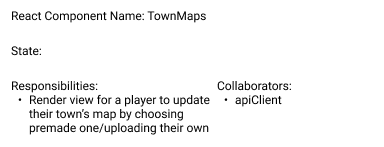
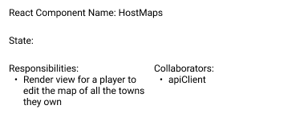

A DESIGN.md document that includes documentation of your design (using CRC cards, UML class
diagrams, and/or UML sequence diagrams as you find necessary; remember that a picture is worth a
thousand words!). In particular, for any change that you had to make to the existing codebase,
provide a rationale for why the change was made, and what alternatives were considered.

Your design document should give a general sense of what you did-- what pieces did you add or
modify?  How do the pieces fit together? Choosing how to explain this is up to you.

DESIGN.md file contains a description of any substantive changes to the existing Covey.Town
codebase, and the architecture of your new code. It uses CRC cards, or state diagrams or any of the
other techniques that help describe the structure. The document is at most 4 pages (fewer pages are
absolutely acceptable, consider this a rough limit) Added 4/8

Documenting our design

FRONTEND

In the front-end, we created three new components for each of our features:

To allow users to browse different avatars and change their character's avatar.

To change any town map or upload a new map, as long as you the player is the host.

To view and mass update the towns of which the player is a host of.

We also created two new types, to pass the information for these user actions: SpriteSheetInfo (data
structure for sprite sheets) CoveyMapTownInfo (data structure for map information)

In the CoveyAppUpdate, for the ‘doConnect’ action, we added the townHost, townMap and spriteSheet
fields to the data so that when a player first connects to the App, the app has access to these
fields to render them. We also added two actions: ‘mapUpdated’ and ‘updateSprite’, to ensure that
when a player updated the map or updated their sprite, the app would update.

We also added several fields to be kept track of by CoveyAppState since they keep track of states
that are dynamic and/or affect what the user sees: CurrentTownHost, CurrentTownMap, and
CurrentSpriteSheet.

BACKEND

In TownServiceClient.ts, we added two new methods: updateSprite and uploadFile, so as handle a
client’s requests to update a player’s sprite and upload a file.

The CoveyTownController now also keeps track of its host (so who created the town) and its map. This
way, when we render it in the front-end, we have easy access to this specific town’s map so as to
render it easily, and also its host, so we can check if a player is the host and if so, allow them
to change the map.

A CoveyTownStore now keeps track and updates the list of possible maps a player can select. Since
this list is applicable to all towns, this made it easy to access the list no matter the town. You
can also update a sprite sheet, by giving it the town ID and player ID. We also updated the
UpdateTown so it also can potentially take in a map to update a town with.

When creating a town, you now also pass in the username of the player who created it since it’s now
a required field in the CoveyTownController constructor. This is so as to only be able to retrieve
that information when rendering the customize maps component.

When making a request to change a sprite, you have to pass the town the player’s and their id, in so
as to find the player and then pass in the new sprite sheet.

We added two handlers: playerUpdateHandler, which handles a dispatch to from the server to update a
player’s sprite sheet and a updateMapsHandler, which handles a dispatch to from the server to update
the CoveyTownStore’s list of town maps.
